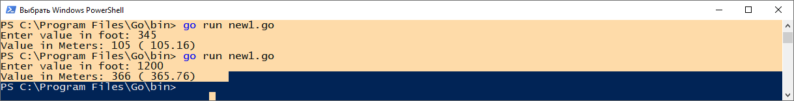
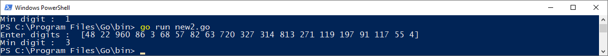
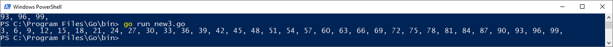

1. 
Задача 1. 
---
Установите golang.

Воспользуйтесь инструкций с официального сайта: https://golang.org/.

Так же для тестирования кода можно использовать песочницу: https://play.golang.org/.

Задача 2. 
---
Знакомство с gotour.
У Golang есть обучающая интерактивная консоль https://tour.golang.org/. 
Рекомендуется изучить максимальное количество примеров. В консоли уже написан необходимый код, осталось только с ним ознакомиться и поэкспериментировать как написано в инструкции в левой части экрана.

Задача 3. 
---
Написание кода.

Цель этого задания закрепить знания о базовом синтаксисе языка. Можно использовать редактор кода на своем компьютере, либо использовать песочницу: https://play.golang.org/.

1. Напишите программу для перевода метров в футы (1 фут = 0.3048 метр). Можно запросить исходные данные у пользователя, а можно статически задать в коде. Для взаимодействия с пользователем можно использовать функцию Scanf:

    package main

    import "fmt"

    func main() {
    fmt.Print("Enter a number: ")
    var input float64
    fmt.Scanf("%f", &input)

    output := input * 2

    fmt.Println(output)    
    }

2. Напишите программу, которая найдет наименьший элемент в любом заданном списке, например:

    x := []int{48,96,86,68,57,82,63,70,37,34,83,27,19,97,9,17,}
3. Напишите программу, которая выводит числа от 1 до 100, которые делятся на 3. То есть (3, 6, 9, …).

В виде решения ссылку на код или сам код.

___

Решение:
---
Задача 1:
---
Установите golang.

    PS C:\Program Files\Go\bin> go version

    go version go1.19 windows/amd64

Задача 2:
---
Знакомство с gotour.

    Ознакомился

Задача 3:
---

1. Напишите программу для перевода метров в футы (1 фут = 0.3048 метр). Можно запросить исходные данные у пользователя, а можно статически задать в коде. Для взаимодействия с пользователем можно использовать функцию Scanf:

Код:

    package main

    import (
    	"fmt"
    	"math"
    )

    func main() {
	    fmt.Print("Enter value in foot: ")
	    var input float64

	    fmt.Scanf("%f", &input)
	    output := input * float64(0.3048)
	    rOutput := math.Round(output)
	    sOutput := fmt.Sprintf("( %.2f)", output)
	    fmt.Println("Value in Meters:", rOutput, sOutput)
    }

2. Напишите программу, которая найдет наименьший элемент в любом заданном списке:

Код:

    package main
        
    import "fmt"
        
    func main() {
            x := []int{48,22,960,86,3,68,57,82,63,720,327,314,813,271,119,197,91,117,55,4}
            current := 0
            fmt.Println ("Enter digits : ", x)
            for i, value := range x {
                if (i == 0) {
                   current = value 
                } else {
                    if (value < current){
                        current = value
                    }
                }
            }
            fmt.Println("Min digit : ", current)
        }    

3. Напишите программу, которая выводит числа от 1 до 100, которые делятся на 3. То есть (3, 6, 9, …).

Код:

    package main
        
    import "fmt"
        
        
    func main() {
            
    for i := 1; i <= 100; i++ {
    if (i%3) == 0 {
    fmt.Print(i,", ")
    }
    }
    }

